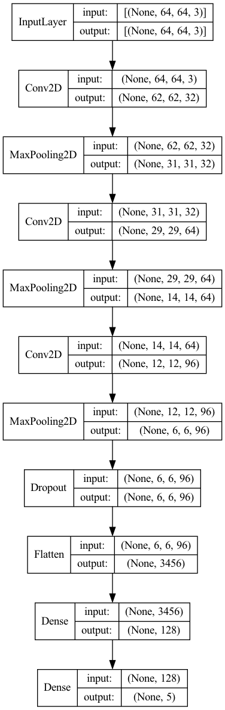
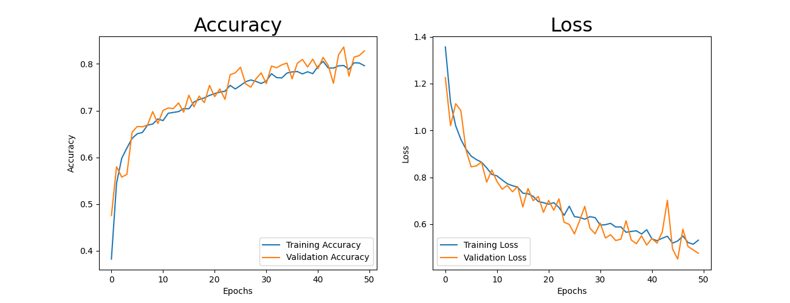
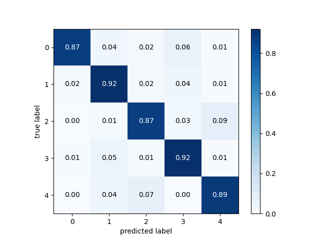

# Question 1: deep learning

## **Description**

1. Setup model via `KERAS` methods
2. Deep learning model option:  DNN(Deep neural network)  or `CNN(convolution neural network)`
3. Evaluate performance & compare 10 prediction results.

- Classification problem
- [`Flower datasets (5 classes)`](https://www.kaggle.com/alxmamaev/flowers-recognition)

----

## **MY SOLUTION**

***(last updated: 3/21)***

1. **Environment (setup)**

    - Miniconda virtual environment
    - M1 PRO (MPS GPU acceralated)
    - Tensorflow version == 2.10.0
    - Python == 3.8.13

2. **Model configuration**

    - Convolution neural network (CNN) aritechure

        

    - Train-test spit ratio: 0.7:0.2 (train:, test:)

    - Epochs: 150; Batch size: 128

3. **prediction result**

    - **Test-set accuracy: 88.31%**
    - Random pick 15 of the test set, return 15 prediction correct

        

    - [**Performance (tensorflow labraries built-in library)**](./output/classification_report.txt)

        |                 |precision |recall   |f1-score  |support|
        |      ----       |   ----   |   ----  |   ----   | ----  |
        |       daisy     |  0.85    |  0.95   |   0.90   |    147|
        |   dendelion     |  0.93    |  0.91   |   0.92   |    200|
        |        rose     |  0.85    |  0.84   |   0.84   |    151|
        |   sunflower     |  0.90    |  0.92   |   0.91   |    140|
        |       tulip     |  0.87    |  0.81   |   0.84   |    192|
        |    accuracy     |          |         |   0.88   |    830|
        |   macro avg     |  0.88    |  0.89   |   0.88   |    830|
        |weighted avg     |  0.88    |  0.88   |   0.88   |    830|

    - **Trainiing log (Accuracy vs loss)**

        

    - **Confusion matrix**

        

4. Conclusion

    From this training result, I learned that the classification is great

    But 