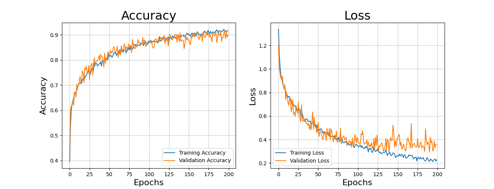

# **Question 1: deep learning**

***(last updated: 3/24)***

## **Description**

1. Setup model via `KERAS` methods
2. Deep learning model option:  DNN(Deep neural network)  or `CNN(convolution neural network)`
3. Evaluate performance & compare 10 prediction results.
4. Details of question:
    - Classification problem
    - [Flower datasets (5 classes)](https://www.kaggle.com/alxmamaev/flowers-recognition)

----

## **MY SOLUTION**

1. **Environment (settings)**

    - Miniconda virtual environment
    - M1 PRO (MPS)
    - Tensorflow version == 2.10.0
    - Python version == 3.8.13

2. **Workflow**

    - Datasets split ratio is **7:2:1** 
        - Training: 3942, Testing: 830, Validation: 1569 (numbers of image)
        - via [splitfolder](https://pypi.org/project/split-folders/)
        - split datasets into three folders respectively
        - ``splitfolders.ratio('./datasets/', './split_datasets/', seed=1337, ratio=(0.7,0.2,0.1))``

    - Model Ariitecture & compile parameters
        - Epochs, Batch size = (200, 32)

            ***Epochs***: the number times that the learning algorithm will work through the entire training dataset.

            ***Batch size***: a number of samples processed before the model is updated

        - optimizer: adam
        - loss function: categorical_crossentropy

        - Convolution neural network (CNN) aritechure

            [](./output/cnn_model.png)

        - Training log (Accuracy vs loss)

            [](./output/result_accuracy_loss.png)

            During the training process, I add dropout layer and image augmentation to avoid ***overfitting***, which can observed by the trend of either accuracy or loss curve.

3. **Multi-class classification proformance evalulation**

    - **Avg accuracy: 89.27%**
    - Random pick 15 of the test set, return 15 prediction correct

        [](./output/cnn_pred_result.png)

        Most of the picture can be predicted correctly!

    - **Confusion matrix**

        [](./output/confusion_matrix.png)

        Result calculated from my CNN model. We can observed among four classes classification, every classes have no significant difference.

    - [**Performance (tensorflow labraries built-in library)**](./output/classification_report.txt)

        |                 |precision |recall   |f1-score  |support|
        |      ----       |   ----   |   ----  |   ----   | ----  |
        |       daisy(0)  |  0.96    |  0.87   |   0.91   |    147|
        |   dendelion(1)  |  0.89    |  0.92   |   0.90   |    200|
        |        rose(2)  |  0.85    |  0.87   |   0.86   |    151|
        |   sunflower(3)  |  0.85    |  0.92   |   0.89   |    140|
        |       tulip(4)  |  0.91    |  0.89   |   0.90   |    192|
        |    accuracy     |          |         |   0.89   |    830|
        |   macro avg     |  0.89    |  0.89   |   0.89   |    830|
        |weighted avg     |  0.89    |  0.88   |   0.89   |    830|

    - Remarks (Definitions):

        ```
        Accuracy Score = (TP + TN) / (TP + TN + FP + FN)
        Precision = TP / (TP + FP) 
        Recall = TP / (TP + FN)
        F1 = 2*Precision*Recall / (Precision + Recall)
        ```

        - ***Macro averaged precision***: calculate precision for all classes individually and then average them
        - ***Micro averaged precision***: calculate class wise true positive and false positive and then use that to calculate overall precision

            

        Cited from [***Kaggle***](https://www.kaggle.com/code/nkitgupta/evaluation-metrics-for-multi-class-classification)

4. Reference

    - [Tensorflow official documents](https://www.tensorflow.org/tutorials/images/cnn)
    - [Kaggle Multi-class evaluation metrics](https://www.kaggle.com/code/nkitgupta/evaluation-metrics-for-multi-class-classification)
    - [ithelp-ML evaluation metric: Accuracy, precision, recall](https://ithelp.ithome.com.tw/articles/10228941)
    - [ithelp-ML evaluation metric: ROC/AUC curve](https://ithelp.ithome.com.tw/articles/10229049)