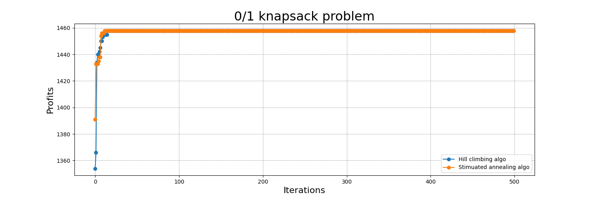
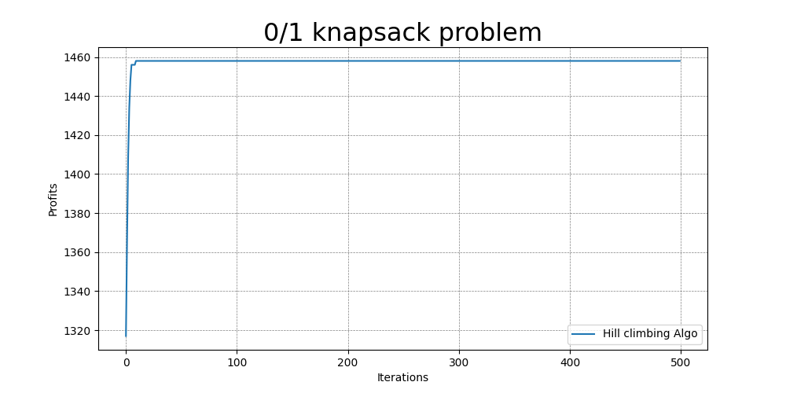
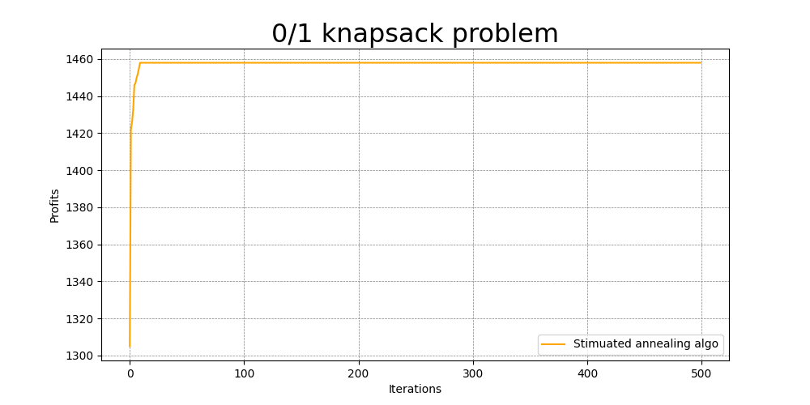

# **Question 2: Meta-heuristic algorithm**

***(last updated 3/25)***

## **Description**

1. 0/1 knapsack problem
2. Approach via `Hill climbing(HC)` & `Simulated annealing(AC)` algorithm.
3. [**Datsets**](https://people.sc.fsu.edu/~jburkardt/datasets/knapsack_01/knapsack_01.html)

    - knapsack capacity: 750
    - weights of the objects:  70, 73, 77, 80, 82, 87, 90, 94, 98, 106, 110, 113, 115, 118, 120
    - profits of each objects: 135, 139, 149, 150, 156, 163, 173, 184, 192, 201, 210, 214, 221, 229, 240
    - optimal selection of weights: 1, 0, 1, 0, 1, 0, 1, 1, 1, 0, 0, 0, 0, 1, 1

---

## **My solution**

1. **Environment (settings)**

    - Miniconda virtual environment
    - M1 PRO
    - Python version == 3.8.13
    - Import packages:
        - ``random``: create random initial states
        - ``math``: power, exponential properities
        - ``matplotlib``: ploting result

2. **Result showcase**

    

    The solution converge to ***1458*** approximately within 30 iterations (merge two curves in one graph)

3. **Workflow**

    - Step1: Concept comprehension
        - [[Medium] ***Optimization Techniques — Simulated Annealing*** from **Frank Liang**](https://towardsdatascience.com/optimization-techniques-simulated-annealing-d6a4785a1de7)
        - [[Youtube] ***Hill Climbing Algorithm & Artificial Intelligence - Computerphile*** from **Computerphile**](https://www.youtube.com/watch?v=oSdPmxRCWws&t=337s)
        - [[Youtube] ***simulated annealing*** from **Francisco Iacobelli**](https://www.youtube.com/watch?v=C86j1AoMRr0)
        - [[Youtube] ***Hill Climbing - Georgia Tech - Machine Learning*** from **Udacity**](https://www.youtube.com/watch?v=kOFBnKDGtJM)
        - [ChatGPT- ask everything](https://chat.openai.com/chat)
    - Step2: Transfer sudo code to python code
    - Step3: Verify via different approaches (Simple recursive, DP, Meta-heuristic)

---

## **GO deep**

1. **0/1 knapsack problem**

    - The 0/1 knapsack problem is a combinational optimization problem, where we are given a set of items, each with a weight and a value, and a knapsack with a maximum weight capacity.

    - The goal is to select a subset of items to be placed in the knapsack such that the total value of the selected items is maximized, subject to the constraint that the total weight of the selected items does not exceed the maximum weight capacity of the knapsack.

    - Reference from ***ChatGPT***

2. **Hill climbing**

    1. Hill climbing is a local search algorithm that starts with an initial solution and iteratively improves the solution by making small modifications to the current solution and accepting the modification if it improves the objective function.

        

    2. Steps to follow

        - 1.Initialization:

            Start with a random solution where each item is either in the knapsack or not. For example, [1, 0, 1, 1, 0, 0, 1, 0, 0, 1, 1, 0, 1, 0, 1].

        - 2.Evaluation:

            Calculate the value of the current solution. In this case, the total weight of the selected items is 750, and the total profit is 2842.

        - 3.Neighbor Generation:

            Generate a set of neighboring solutions by flipping the inclusion status of one item in the current solution. For example, [0, 0, 1, 1, 0, 0, 1, 0, 0, 1, 1, 0, 1, 0, 1].

        - Selection:

            Select the neighbor with the highest value. In this case, we evaluate the value of the new solution by calculating the total weight and profit, and select the neighbor with the highest profit.

        - 5.Termination:
             If the selected neighbor has a higher value than the current solution, set it as the new current solution and go back to step 2. If no neighbor has a higher value, terminate and return the current solution.

        - 6.Repeat steps 2-5 until a good solution is found or a maximum number of iterations is reached.

    3. Main functions to implement HC algo.

        - **Candidate Solution Representation**:

            In the 0/1 knapsack problem, a candidate solution is a binary vector of length n, where each element corresponds to an item in the set, and its value indicates whether the item is selected (1) or not (0).

        - **Fitness Function**:

            The fitness function evaluates the objective function of the candidate solution. In the 0/1 knapsack problem, the fitness function calculates the total value of the selected items in the candidate solution. 

            If the total weight of the selected items exceeds the maximum weight capacity of the knapsack, the fitness function returns a penalty value (e.g., 0) to discourage such solutions.

        - **Neighborhood Structure**:

            The neighborhood structure defines the set of candidate solutions that are obtained by making small modifications to the current solution.

            In the 0/1 knapsack problem, a simple neighborhood structure is to **flip a single bit (item)** in the candidate solution. Thus, each neighbor of the current solution can be obtained by flipping a single bit.

    4. **Result showcase (converge to 1458)**

        

3. **Simulated annealing**

    1. Simulated annealing is a technique for minimizing functions that makes use of the ideas from Markov chain Monte Carlo samplers. [Reference](https://bookdown.org/rdpeng/advstatcomp/simulated-annealing.html)

    2. Steps to follow:
        - 1.Initialization:

            Start with a random solution where each item is either in the knapsack or not.
        - 2.Evaluation:

            Calculate the value of the current solution.

        - 3.Neighbor Generation:

            Generate a set of neighboring solutions by flipping the inclusion status of one item in the current solution.

        - 4.Selection: Select a neighbor solution randomly.
        - 5.**Acceptance Probability**:

            Calculate the acceptance probability of the selected neighbor solution using the current temperature and the difference in value between the current and neighbor solutions.

            The acceptance probability is given by the **Boltzmann distribution: exp(-delta/T)**, where delta is the difference in value between the current and neighbor solutions, and T is the current temperature.

            

        - 6.Termination:

            If the selected neighbor solution is better than the current solution, set it as the new current solution.If the selected neighbor solution is worse than the current solution, accept it with a probability calculated in step 5. Update the temperature according to a cooling schedule, which reduces the temperature over time.

            Repeat steps 2-6 until a good solution is found or a maximum number of iterations is reached.
        - Output: Return the best solution found.

    3. Main functions to implement SA algo.

        - Candidate Solution Representation, fitness function and neighborhood structure: same as hill climbing
        - ``simulated_annealing(max_iterations, initial_temperature, cooling_rate)``

            It start with a random initial solution and generate neighboring solutions by flipping one bit at a time. We then calculate the values of the current and neighbor solutions, and calculate the acceptance probability using the Boltzmann distribution.

            We decide whether to accept the neighbor solution based on this acceptance probability, and update the temperature according to a geometric cooling schedule.

            After the loop, we find the best solution by evaluating the current solution and printing the results. Note that the results may vary between runs due to the stochastic nature of the algorithm.

    4. **Result showcase (converge to 1458)**

        

4. **Difference between two algorthms**

    The key difference between Hill Climbing and Simulated Annealing is the acceptance probability calculation in step 5. By using the **temperature parameter**, Simulated Annealing can explore the search space more widely, and with the right cooling schedule, can find a global optimal solution.

    The cooling schedule determines how the temperature decreases over time. There are several common cooling schedules, including linear, geometric, and logarithmic. A common cooling schedule is to use a geometric cooling schedule, where the temperature decreases by a constant factor after each iteration: T = alpha * T, where alpha is a constant factor between 0 and 1. The value of alpha depends on the problem and can be determined empirically.

    **Simulated Annealing** is a **stochastic algorithm**, so the results may vary between runs. It is often useful to run the algorithm multiple times with different random seeds and choose the best solution found.