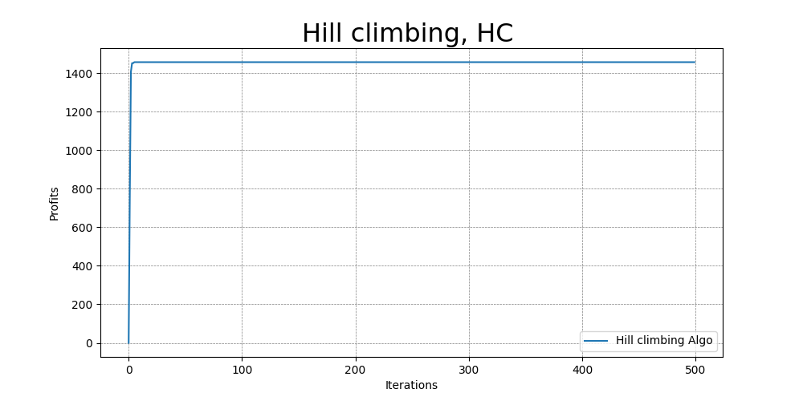

# Question 2: deep learning

## **Description**

1. 0/1 knapsack problem
2. Sovle 0/1 knapsack problem via `Hill climbing(HC)` & `Simulated annealing(AC)` algorithm.

## [**Datsets**](https://people.sc.fsu.edu/~jburkardt/datasets/knapsack_01/knapsack_01.html)

- knapsack capacity: 750
- weights of the objects:  70, 73, 77, 80, 82, 87, 90, 94, 98, 106, 110, 113, 115, 118, 120
- profits of each objects: 135, 139, 149, 150, 156, 163, 173, 184, 192, 201, 210, 214, 221, 229, 240
- optimal selection of weights: 1, 0, 1, 0, 1, 0, 1, 1, 1, 0, 0, 0, 0, 1, 1

---

## **My solution**

***(last updated 3/22)***

### After 500 iterations convergence

---

### **Thoughts**

**0/1 knapsack problem**

- The 0/1 knapsack problem is a combinatorial optimization problem, where we are given a set of items, each with a weight and a value, and a knapsack with a maximum weight capacity. The goal is to select a subset of items to be placed in the knapsack such that the total value of the selected items is maximized, subject to the constraint that the total weight of the selected items does not exceed the maximum weight capacity of the knapsack.

#### **Hill climbing**

1. Hill climbing is a local search algorithm that starts with an initial solution and iteratively improves the solution by making small modifications to the current solution and accepting the modification if it improves the objective function. To apply hill climbing to the 0/1 knapsack problem, we need to define a candidate solution representation, a fitness function, and the neighborhood structure.

- Candidate Solution Representation:
In the 0/1 knapsack problem, a candidate solution is a binary vector of length n, where each element corresponds to an item in the set, and its value indicates whether the item is selected (1) or not (0).

- Fitness Function:
The fitness function evaluates the objective function of the candidate solution. In the 0/1 knapsack problem, the fitness function calculates the total value of the selected items in the candidate solution. If the total weight of the selected items exceeds the maximum weight capacity of the knapsack, the fitness function returns a penalty value (e.g., 0) to discourage such solutions.

- Neighborhood Structure:
The neighborhood structure defines the set of candidate solutions that are obtained by making small modifications to the current solution. In the 0/1 knapsack problem, a simple neighborhood structure is to flip a single bit (item) in the candidate solution. Thus, each neighbor of the current solution can be obtained by flipping a single bit.

#### **Simulated annealing**
